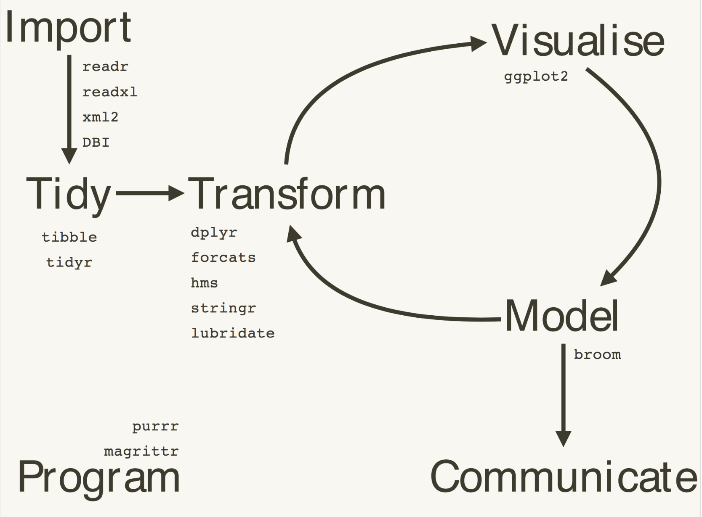

---
title: <span style="color:#88398A"> Tidyverse</span>
author: "Natalia da Silva"
output:
  ioslides_presentation: default
  beamer_presentation: default
---
<!-- # R-Ladies ggplot2 theme -->
<!-- # main purple color: #88398A -->
<!-- # grey color: #D3D3D3 -->
<!-- # black color: #181818 -->
<!-- # white color: #FFFFFF -->
<!-- # dark purple color: #562457 -->
<!-- # font Helvetica Neue -->

<style>
   .title-slide {
        background-image: url(tidyverse.png);
        background-repeat: no-repeat;
        padding:40px;
         position: fixed;
    top: 50%;
     left: 50%;
        background-size: 600px 600px;
     }
      </style>
```{r setup, include=FALSE}
knitr::opts_chunk$set(echo = FALSE)
```

## <span style="color:#88398A">Estructura </span>

- Qué es el tidyverse

- Para qué sirve y cómo usarlo

- Ejercicio de práctica


## <span style="color:#88398A">Qué es el Tidyverse </span>
`tidiverse`

- conjunto de paquetes de R diseñados para la ciencia de datos.

- todos los paquetes comparten una misma filosofía de datos y de programación en R.
y están diseñados para trabajar conjuntamente de forma natural.

***Objectivo:*** resolver problemas complejos combinando piezas simples y uniformes

## <span style="color:#88398A">Cosas practicas que debemos saber </span>
- Existe

- Tiene una página web https://www.tidyverse.org

- Tiene un paquete `tidyverse`

- Tiene un libro: ***R for Data Science*** http://r4ds.had.co.nz


## <span style="color:#88398A">Principios del tidyverse </span>


 Los cuatro principios básicos para una tidy API (Interfaz de Programación de Aplicaciones):

- Reutilizar estructuras de datos existentes

- Componer funciones simples con la pipa `%>%`


- Utilizar programación funcional


- Diseñado para humanos
## <span style="color:#88398A">Para qué sirve</span>

Los paquetes en el Tidyverse tienen como objetivo cubrir todas las fases del análisis de datos dentro de R:

 - Importar datos

 - Ponerlos en formato ordenado (tidy)

 - Buscar relaciones entre ellos (mediante su transformación, visualización y creación de modelos)

 - Comunicar los resultados


## <span style="color:#88398A">Diagrama </span>




## <span style="color:#88398A">Cómo usarlo</span>

***Instalando tidyverse instalo todo***

```{r echo=TRUE, eval=FALSE}

install.packages("tidyverse")


install.packages(c(
  "broom", "dplyr", "feather",
  "forcats","ggplot2", "haven",
  "httr", "hms", "jsonlite",
  "lubridate", "magrittr",
  "modelr", "purrr", "readr",
  "readxl", "stringr", "tibble",
  "rvest", "tidyr", "xml2"
))
```


## <span style="color:#88398A">Cómo usarlo </span>
 ***Cargando el tidyverse,  tenemos el core***
```{r echo=TRUE, eval=FALSE}

library(tidyverse)

# en vez de esto
  library(ggplot2)
  library(tibble)
  library(tidyr)
  library(readr)
  library(purrr)
  library(dplyr)
```


## <span style="color:#88398A">Algunos pkg</span>

 - Importar: `readr`

 - Ordenar: `tidyr`

 - Transformar: `dplyr`

 - Visualizar: `ggplot2`


## <span style="color:#88398A">Importar: `readr`</span>

- ***Objetivo:*** provee una forma rápido y amigable de leer datos rectangulares
 (como csv, tsv, and fwf).

 - Está diseñado para analizar gramaticalmente de forma flexible muchos tipos de datos.

- Para leer correctamente datos rectangulares hay que combinar dos piezas:
una función que analiza el archivo global y una que especifica las columnas.


## <span style="color:#88398A">Importar: `readr`</span>


`readr`  soporta 7 formatos con 7 funciones `read_`:

- `read_csv()`: archivos separados por coma (CSV) files
- `read_tsv()`: archivos separados por espacios
- `read_delim()`: archivos con delimitación general
- `read_fwf()`: archivos con ancho fijo
- `read_table()`: archivos tabulares donde las columnas están separadas por espacios en blanco
- `read_log()`: web log files


## <span style="color:#88398A">Importar: `readr` ejemplo</span>

```{r echo=TRUE, eval=FALSE}
mtcars <- read_csv(readr_example("mtcars.csv"))
 Parsed with column specification:
 cols(
  mpg = col_double(),
  cyl = col_integer(),
  disp = col_double(),
  hp = col_integer(),
  drat = col_double(),
  wt = col_double(),
  qsec = col_double(),
  vs = col_integer(),
  am = col_integer(),
  gear = col_integer(),
  carb = col_integer()
 )
```
## <span style="color:#88398A">Ordenar: `tidyr` </span> 
 Se usa para crear datos "tidy" ordenados, limpios

Que son datos tidy?

- Cada variable está en una columna

- Cada observación está en cada fila

- Cada valor está en una celda

datos "tidy" describe una forma estandard de guardar datos que es usada en todo el "tidyverse"

## <span style="color:#88398A"> Verbos de `tidyr`</span> 

- `gather` y `spread`  modifican la forma de los datos, cambian las columnas a filas y vice versa 

- `separate` parte las columnas en múltiples variables

## <span style="color:#88398A"> Ejemplo `gather`  </span> 
```{r echo = TRUE, eval = FALSE}
stocks <- tibble(
  time = as.Date('2009-01-01') + 0:9,
  Montevideo = rnorm(10, 0, 1),
  Maldonado = rnorm(10, 0, 2),
  Rocha = rnorm(10, 0, 4)
)

head(stocks)
# A tibble: 6 x 4
        time Montevideo  Maldonado     Rocha
      <date>      <dbl>      <dbl>     <dbl>
1 2009-01-01  0.2052207  0.6565487 -4.738786
2 2009-01-02 -0.1087310 -2.9227419 -1.745734
3 2009-01-03  1.1772593  0.5294116  1.045012
4 2009-01-04 -0.4629862  1.2915211  7.605184
5 2009-01-05 -0.9197529  0.6510310  5.599445
6 2009-01-06 -2.5396264 -0.7026716 -5.858824
```

## <span style="color:#88398A"> Ejemplo `gather`  </span> 
`gather`  toma muchas columnas y las collapsa en base al key-value. Usamos gather cuando tenemos columnas que no son variables.

```{r echo = TRUE, eval = FALSE}

gather(data = stocks, key  = stock, value = price, -time)
# A tibble: 30 x 3
         time      stock      price
       <date>      <chr>      <dbl>
 1 2009-01-01 Montevideo  0.2052207
 2 2009-01-02 Montevideo -0.1087310
 3 2009-01-03 Montevideo  1.1772593
 4 2009-01-04 Montevideo -0.4629862
 5 2009-01-05 Montevideo -0.9197529
 6 2009-01-06 Montevideo -2.5396264
# ... with 24 more rows

#usando la piapa
stocks %>% gather(key = stock, value = price, -time)

```

## <span style="color:#88398A"> Ejemplo `spread`  </span>
```{r echo = TRUE, eval = FALSE}
stocksm <- stocks %>% gather(key = stock, value = price, -time)
stocksm %>% spread(key = stock, value = price)

# A tibble: 10 x 4
         time  Maldonado Montevideo      Rocha
 *     <date>      <dbl>      <dbl>      <dbl>
 1 2009-01-01  0.6565487  0.2052207 -4.7387865
 2 2009-01-02 -2.9227419 -0.1087310 -1.7457338
 3 2009-01-03  0.5294116  1.1772593  1.0450124
 4 2009-01-04  1.2915211 -0.4629862  7.6051841
 5 2009-01-05  0.6510310 -0.9197529  5.5994449
 6 2009-01-06 -0.7026716 -2.5396264 -5.8588238
 7 2009-01-07  3.2556331  1.4617536 -7.2923285
 8 2009-01-08 -0.4598225  1.6933693 -1.6910630
 9 2009-01-09 -1.1479666 -0.5047989 -0.8660619
10 2009-01-10 -3.3583649  1.7784029  6.3060244
```

## <span style="color:#88398A"> Ejemplo `separate`  </span>
```{r echo = TRUE, eval = FALSE}

df <- data.frame(x = c(NA, "a.b", "a.d", "b.c"))
head(df)
     x
1 <NA>
2  a.b
3  a.d
4  b.c

df %>% separate(x, c("A", "B"))
     A    B
1 <NA> <NA>
2    a    b
3    a    d
4    b    c
```

## <span style="color:#88398A">Transformar: `dplyr`</span> 
- `dplyr` se usa para la manipulación y transformación de datos. Se enfoca en herramientas para trabajar con data frames.
 
- Las funciones de `dplyr` retornan objectos tibble (data.frame con funcionalidades extra)

-Las principales funcionalidades son un conjuntos de verbos que representan distintas objetivos del datq análisis:

`filter`, `select`, `arrange`, `mutate`, `summarise`,
`group_by`

## <span style="color:#88398A">`filter`</span>
filter(data, expr1, ...)

`filter` es una función que toma un conjunto de datos y los subdivide de acuerdo a un conjunto de expresiones.

```{r echo=TRUE, eval=FALSE}
head(mtcars)
# A tibble: 6 x 11
    mpg   cyl  disp    hp  drat    wt  qsec    vs    am  gear  carb
  <dbl> <int> <dbl> <int> <dbl> <dbl> <dbl> <int> <int> <int> <int>
1  21.0     6   160   110  3.90 2.620 16.46     0     1     4     4
2  21.0     6   160   110  3.90 2.875 17.02     0     1     4     4
3  22.8     4   108    93  3.85 2.320 18.61     1     1     4     1
4  21.4     6   258   110  3.08 3.215 19.44     1     0     3     1
5  18.7     8   360   175  3.15 3.440 17.02     0     0     3     2
6  18.1     6   225   105  2.76 3.460 20.22     1     0     3     1
```
## <span style="color:#88398A">`filter`</span>

```{r echo=TRUE, eval=FALSE}
mtcars %>% filter(mpg > 22)
# A tibble: 9 x 11
    mpg   cyl  disp    hp  drat    wt  qsec    vs    am  gear  carb
  <dbl> <int> <dbl> <int> <dbl> <dbl> <dbl> <int> <int> <int> <int>
1  22.8     4 108.0    93  3.85 2.320 18.61     1     1     4     1
2  24.4     4 146.7    62  3.69 3.190 20.00     1     0     4     2
3  22.8     4 140.8    95  3.92 3.150 22.90     1     0     4     2
4  32.4     4  78.7    66  4.08 2.200 19.47     1     1     4     1
5  30.4     4  75.7    52  4.93 1.615 18.52     1     1     4     2
6  33.9     4  71.1    65  4.22 1.835 19.90     1     1     4     1
7  27.3     4  79.0    66  4.08 1.935 18.90     1     1     4     1
8  26.0     4 120.3    91  4.43 2.140 16.70     0     1     5     2
9  30.4     4  95.1   113  3.77 1.513 16.90     1     1     5     2
```

## <span style="color:#88398A">`arrange`</span>
- Reordena las filas de un data frame
- desc()  ordena las filas en orden descendente


```{r echo=TRUE, eval=FALSE}
arrange(mtcars, desc(mpg) )

# A tibble: 32 x 11
     mpg   cyl  disp    hp  drat    wt  qsec    vs    am  gear  carb
   <dbl> <int> <dbl> <int> <dbl> <dbl> <dbl> <int> <int> <int> <int>
 1  33.9     4  71.1    65  4.22 1.835 19.90     1     1     4     1
 2  32.4     4  78.7    66  4.08 2.200 19.47     1     1     4     1
 3  30.4     4  75.7    52  4.93 1.615 18.52     1     1     4     2
 4  30.4     4  95.1   113  3.77 1.513 16.90     1     1     5     2
 5  27.3     4  79.0    66  4.08 1.935 18.90     1     1     4     1
 6  26.0     4 120.3    91  4.43 2.140 16.70     0     1     5     2
 7  24.4     4 146.7    62  3.69 3.190 20.00     1     0     4     2
 8  22.8     4 108.0    93  3.85 2.320 18.61     1     1     4     1
 9  22.8     4 140.8    95  3.92 3.150 22.90     1     0     4     2
10  21.5     4 120.1    97  3.70 2.465 20.01     1     0     3     1
# ... with 22 more rows

```

## <span style="color:#88398A">`select`</span>
- Se usa para seleccionar una columna particular del data frame
- Hay funciones selectoras como `starts_with`, `ends_with`, `matches`
```{r echo=TRUE, eval=FALSE}
select(mtcars, ends_with("t") )

# A tibble: 32 x 2
    drat    wt
   <dbl> <dbl>
 1  3.90 2.620
 2  3.90 2.875
 3  3.85 2.320
 4  3.08 3.215
 5  3.15 3.440
 6  2.76 3.460


```
## <span style="color:#88398A">`mutate`</span>
- Se usa para cambiar una columna o agregar una nueva como función de valores existentes
- `mutate(data, var1 = expr1, var2 = expr2, ...)`
- El nuúmero de columnas cambia pero no las filas 

```{r echo=TRUE, eval=FALSE}
mtcars %>% select(mpg, cyl, wt) %>% mutate(wtkg = wt*0.45359*1000)

# A tibble: 32 x 4
     mpg   cyl    wt     wtkg
   <dbl> <int> <dbl>    <dbl>
 1  21.0     6 2.620 1188.406
 2  21.0     6 2.875 1304.071
 3  22.8     4 2.320 1052.329
 4  21.4     6 3.215 1458.292
 5  18.7     8 3.440 1560.350

```


## <span style="color:#88398A"> `group_by` y `summarise`</span>

- `group_by` toma los datos y introduce grupos para cada nivel de la varible de grupo


- `summarise` Crea resumenes de data frames por grupos, el resultado es una fila para cada grupo de datos.

`group_by` y `summarise` para un data frame agrupado el resumen estadiístico será calculado para cada grupo. 

## <span style="color:#88398A"> `group_by` y `summarise`</span>

```{r echo=TRUE, eval=FALSE}
mtcars %>%
  group_by(cyl) %>%
  summarise(cyl_n = n() )

# A tibble: 3 x 2
    cyl cyl_n
  <int> <int>
1     4    11
2     6     7
3     8    14

```
## <span style="color:#88398A">Visualizar: `ggplot2`</span> 
- `ggplot2` nos permite crear gráficos basados en "The Grammar of Graphics". 

- Apliamente utilizado para hacer gráficos estadísticos, más de 1.75 millones de bajadas de CRAN en 2015 (aprox 6200 por día)

- Desarrollado por Hadley Wickham (alumno de ISU)

- Está diseñado siguiendo buenas prácticas de visualización (gramática de gráficos) e implementa una amplia variedad de plots

- La construción de los plots está basado en el concepto de capas

## <span style="color:#88398A">Visualizar: `ggplot2`</span> 
Los gráficos en `ggplot2` consisten en:

- ***data***: con mapeos (aes) entre los datos y los elementos gráficos

- ***layers***: elementos geométricos (geoms, son points, lineas, rectangulos, texto, ...) y transformaciones etadísticas(stats, son conteos, bins, identidades)

- ***scales***: mapea valores en el espacio de los datos a valores en el espacio de los aesthetics (ej. color, size, shape y posición)


- ***Sistema de coordenadas***: en general Cartesiana pero pie charts usan cordenadas polares (***NEVER PIE CHART!!***)

- ***facetting***: dividir el plot en multiples paneles 

- ***theme***: arrglo final, como fuente y su tamaño color de fondo etc.


## <span style="color:#88398A">Visualizar: `ggplot2`</span>
```{r echo=TRUE, fig.height=4}
library(ggplot2)
ggplot(data = mpg, aes(x = cty, y = hwy) ) + 
  geom_point() 
```

## <span style="color:#88398A">Visualizar: `ggplot2`</span>
```{r echo=TRUE, fig.height=4}
library(ggplot2)
ggplot(data = mpg, aes( x = class, y = cty ) ) + 
  geom_boxplot()  + 
   labs(y ='city miles per gallon') 
```

## <span style="color:#88398A">Ejercicio `ChickWeight` </span> 

```{r echo=TRUE}
head(ChickWeight)
```

